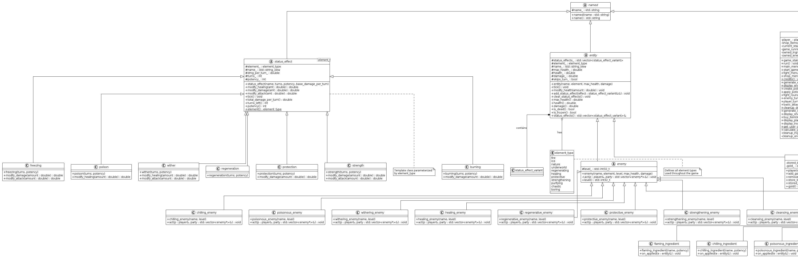

# Potion Maker

The one and only original Potion Maker. This is a university project

## BUILDING THE PROJECT

If you are going to evaluate my project you probably care about this part
the most. Compile it by shoving all the `.cc` (and `.hh` if you want to
precompile those) files into your preferred compiler, making sure
that you are **compiling under C++20**.

### Method 1: Globbing or Manual

```shell
# First change your directory to src
cd src

# Globbing
g++ -std=c++20 *.cc
# or
g++ -std=c++20 *.cc *.hh

# Manual, beautifully listed out
g++ -std=c++20 entity.cc ingredient.cc main.cc potionmaker_game.cc status_effect.cc util.cc
# or
g++ -std=c++20 entity.cc ingredient.cc main.cc potionmaker_game.cc status_effect.cc util.cc element_type.hh entity.hh entity_names.hh ingredient.hh ingredient_names.hh potionmaker_game.hh status_effect.hh util.hh

```

### Method 2: CMake

If you're like me, and you feel like CMake is simultaneously the worst and
best thing that has happened to C++ then you probably have it insalled.

```shell
# Unix Based because I actually have no idea how CMake operates on NT
mkdir build && cd build
cmake ..
make || ninja || # whichever you use
```

## What is it?

Potion Maker is a small RPG turn-based game in which you fight a variety
of monsters by concocting potions. Each potion may be made up of one or more
ingredients, all of which have different effects and powers.

## Why?

Our assignment requires us to create a project in which we can apply the
principles of polymorphism. Although forced, they are present in this project.

## Under which circumstances does it not work?

If you don't wanna have fun, then it doesn't work. Apart from that, every
aspect of the game should be tightly controlled. Just don't input strings
where you're being asked for numbers, please.

## UML Diagram

Mmmh, standards.

The UML diagram is far tool large to render in a single PNG in a README.
**Please check out the [PDF version](resources/UML-Diagram.pdf)**.



